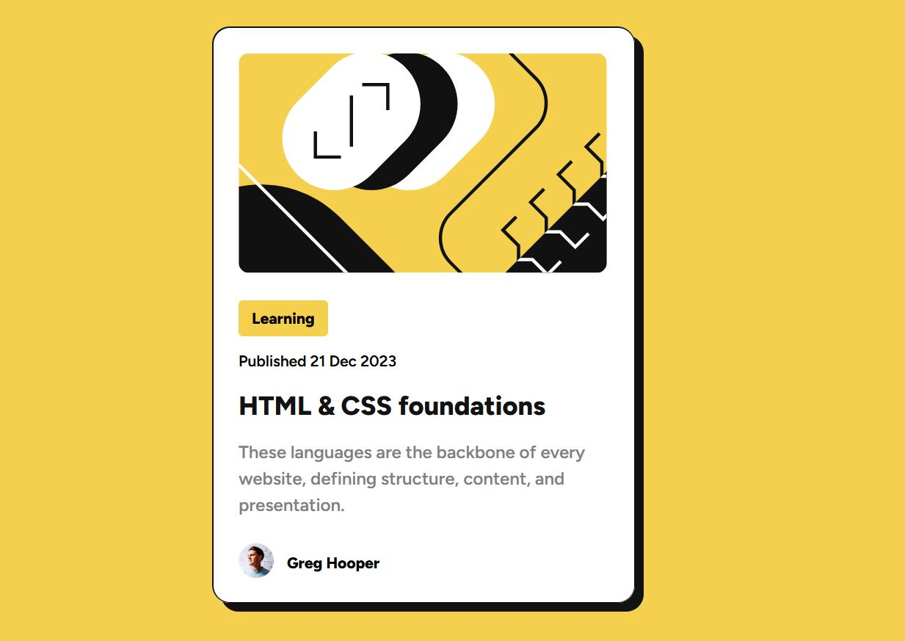

# Frontend Mentor - Blog preview card solution

This is a solution to the [Blog preview card challenge on Frontend Mentor](https://www.frontendmentor.io/challenges/blog-preview-card-ckPaj01IcS). Frontend Mentor challenges help you improve your coding skills by building realistic projects.

## Table of contents

- [Overview](#overview)
  - [The challenge](#the-challenge)
  - [Screenshot](#screenshot)
  - [Links](#links)
- [My process](#my-process)
  - [Built with](#built-with)
  - [What I learned](#what-i-learned)
  - [Continued development](#continued-development)
  - [Useful resources](#useful-resources)
- [Author](#author)
- [Acknowledgments](#acknowledgments)

**Note: Delete this note and update the table of contents based on what sections you keep.**

## Overview

### The challenge

Users should be able to:

- See hover and focus states for all interactive elements on the page

### Screenshot



### Links

- Solution URL: [https://github.com/jiricmiel/blog-preview-card-main](https://your-solution-url.com)
- Live Site URL: [https://blog-preview-card-main-orpin-pi.vercel.app/](https://your-live-site-url.com)

## My process

### Built with

- Semantic HTML5 markup
- CSS custom properties
- CSS Grid
- Flexbox
- Desktop-first workflow

### What I learned

On this project I've tried to put semantic HTML to live.
I learned how to work with variable and static fonts and also how to use @font-face.
I deepened my knowledge on SASS partials and their propper implementation using @forward and @use.

To see how you can add code snippets, see below:

```
@font-face {
  font-family: "Figtree";
  font-style: normal;
  font-weight: 100 900;
  src: url(../assets/fonts/Figtree-VariableFont_wght.ttf)
    format("truetype-variations");
}
```

### Continued development

In the future I'm ready to dig in JS for sure as I've already started the learning proces.
In regards of HTML & CSS I'm going to continue my learning and deepening of my knowledge as there is so much of it and it's only the begining.
I'll probably stick with using SASS (.scss).

### Useful resources

- [Chat GPT](https://chatgpt.com/) - Chat GPT was very usefull. It helped me with finding correct way of implementing SASS partials and using @font-face.
- [Kevin Powel](https://github.com/kevin-powell) - as always Kevin helps with everything.
- [Jonas Schmedtmann](https://github.com/jonasschmedtmann) - same as Kevin. His courses helped me alot.

## Author

- Website - [Add your name here](https://www.your-site.com)
- Frontend Mentor - [@jiricmiel](https://www.frontendmentor.io/profile/jiricmiel)
- LinkedIn - [@jiricmiel](https://www.linkedin.com/in/jiricmiel)

## Acknowledgments

This is where you can give a hat tip to anyone who helped you out on this project. Perhaps you worked in a team or got some inspiration from someone else's solution. This is the perfect place to give them some credit.
